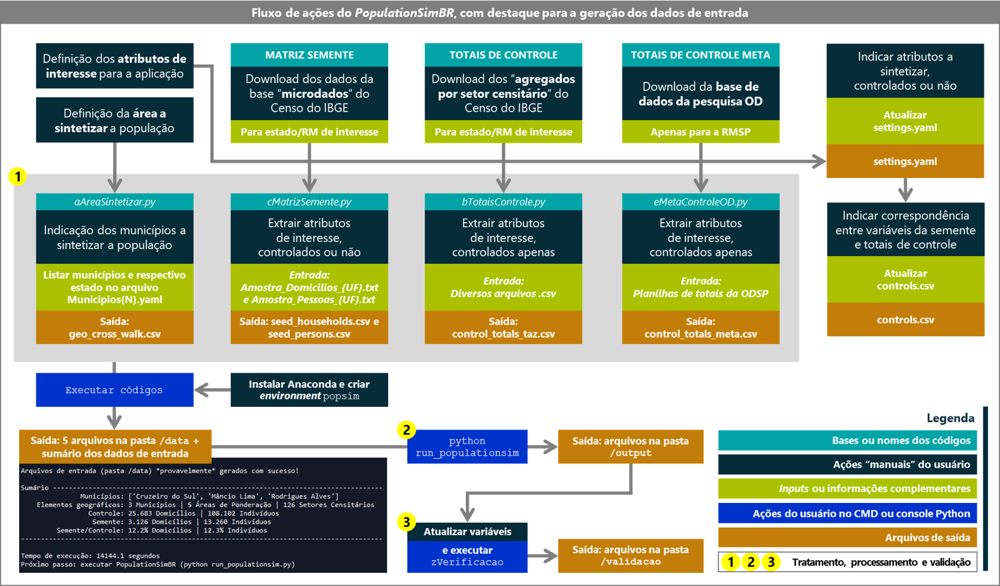

Guia de instalação e uso
==========

Instalação do Anaconda
---------
...e criação de um "environment"

Estrutura de pastas
-----------
... incluindo, além de conteúdo do PopulationSim, a pasta ``/bruto``

Uso da extensão para aplicação no Brasil
-----------

