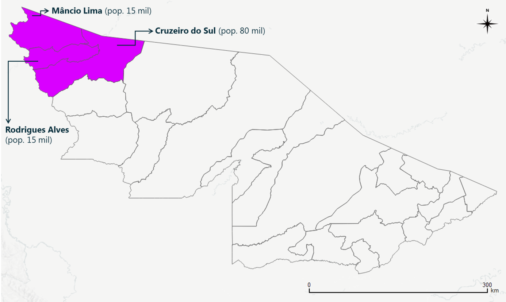

Tutorial: aplicação para oeste do Acre
=========

Introdução
---------
O tutorial para a utilização da extensão do PopulationSim no Brasil – assim como próprio PopulationSim com dados de entrada brasileiros – utiliza três municípios no norte do Acre como piloto. A população destes municípios somava aproximadamente 110 mil habitantes no Censo 2010. Dois destes municípios (Mâncio Lima e Rodrigues Alves) apresentam uma área de ponderação (“apond”) cada, enquanto o terceiro (Cruzeiro do Sul) é dividido em três “aponds”.

Passo a passo
---------
**Intro**

O tempo de processamento, em computador com processador Intel Core i5-3470 CPU @ 3,20 GHz e 12 GB foi de 4 minutos.

Resultados e Validação
---------
